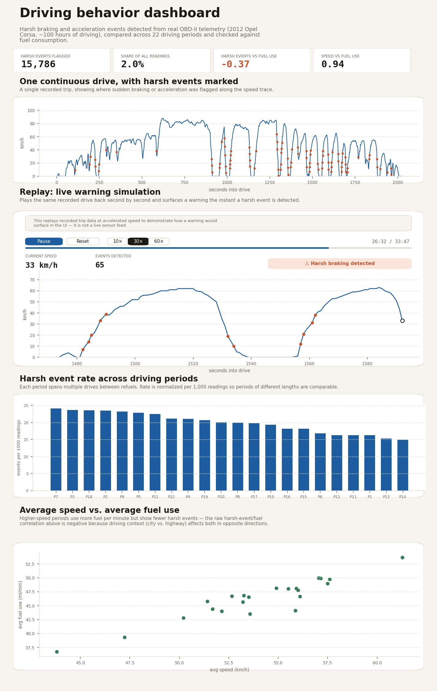

# Driving behavior analysis

📄 [Technical Report (PDF)](docs/technical_report.pdf)

I built this project to understand something concrete about how software can make sense of real vehicle data — not a simulated dataset, but actual OBD-II telemetry from a car being driven for a year. The goal was to detect risky driving moments (hard braking, sudden acceleration) directly from raw sensor readings, check whether that detection actually means anything, and turn the result into something visual.

This started as a portfolio project while preparing to apply for a master's in automotive software / HMI. The detection method here is deliberately simple — no machine learning, just a statistically grounded threshold — because the point was to get the fundamentals right before adding complexity. See [Limitations](#limitations--next-steps) for where this could go next.

## Dataset

This project analyzes real-world OBD-II telemetry from a 2012 Opel Corsa 1.2 (A12XER, 84 hp), collected over roughly 100 hours of driving between April 2025 and June 2026. Data and methodology courtesy of [OBD2_panel_opel_2012 on Kaggle](https://www.kaggle.com/datasets/pedro2025/obd2-panel-opel-2012) ([logger source code](https://github.com/pedro2025-prog/obd2-live-panel)), licensed under CC BY 4.0.

The raw file contains about 789,000 timestamped readings across 22 periods, each spanning several individual drives between refuels. Signals used here: RPM, speed, throttle position, coolant temperature, gear, and fuel usage.

A few things worth knowing about the raw data before trusting any numbers below:
- A handful of `SPEED` readings sit exactly at 255, the sensor's upper bound — this is a known invalid-reading placeholder, not an actual speed, and those rows were dropped.
- `GEAR` isn't reported directly by the ECU. It's inferred from the RPM-to-speed ratio using a heuristic documented by the dataset's author, so treat it as an estimate.
- A few derived columns (`TORQUE`, `POWER`) had large gaps from ECU polling limitations and weren't reliable enough to use.

Full write-up: [`docs/data_cleaning.md`](docs/data_cleaning.md).

## Method

Two scripts do the actual work:

**`clean_data.py`** strips the raw file down to the 11 columns that matter, fixes the timestamp format, drops the invalid speed readings, and sorts everything chronologically within each driving period. Output: `data/dataset_clean.csv.xz`.

**`analyze_data.py`** does the interesting part. Speed alone doesn't tell you much about risk — what matters is how *fast* it changes. So the script computes instantaneous acceleration from consecutive speed readings (per trip, so one drive's last reading never gets compared against the next drive's first), then flags the bottom and top 1% of that distribution as harsh braking and harsh acceleration. That threshold isn't a guess — it comes straight from the shape of this car's own data. Full explanation: [`docs/analysis.md`](docs/analysis.md).

Run it:
```bash
pip install -r requirements.txt
python clean_data.py
python analyze_data.py
```

## What the data actually shows

15,786 harsh events out of ~789,000 readings (2%), spread unevenly — some driving periods have nearly twice the harsh-event rate of others.

The part I didn't expect: harsh events don't correlate with higher fuel use. The raw correlation is actually **-0.37**. Digging into why, average speed turned out to be the confound — it correlates strongly with fuel use (+0.94) but negatively with harsh events (-0.29). Highway-style driving burns more fuel per minute just from sustained engine load, but it's smoother, with fewer sudden inputs. City driving is the opposite: lots of harsh events from stop-and-go traffic, but lower fuel use per minute since the car spends more time idling or at low RPM. So "harsh driving" and "fuel-hungry driving" turned out to be two different things, not two names for the same thing.

## Dashboard

`dashboard/` is a small React app that visualizes this: a real drive with harsh events marked on the speed trace, a comparison of harsh-event rate across all 22 periods, and the speed-vs-fuel relationship that explains the correlation above.

It also includes a **replay simulation**: it plays back one recorded drive second-by-second at adjustable speed (10×/30×/60×) and surfaces a warning banner the instant a harsh event is detected — a stand-in for how this detection logic could feed a real-time in-car alert.

**This is a web app, not an in-vehicle system.** It runs in a regular browser on a laptop or phone, not on a car's instrument cluster or infotainment display, and the replay is a simulation of recorded data, not a live sensor feed. It's a proof of concept for the detection logic and warning UI, not a production HMI. The trip shown is picked by [`generate_drive_sample.py`](generate_drive_sample.py), which selects the drive (20–40 minutes long) with the most harsh events, so the demo has something to show rather than a quiet trip.

```bash
cd dashboard
npm install
npm run dev
```



## Tests

`clean_data.py` and `analyze_data.py` are covered by unit tests using small, hand-built data instead of the full dataset, so they run in under a second and check exact expected values (e.g. that acceleration is never computed across a trip boundary, that harsh events are correctly flagged at the 1st/99th percentile).

```bash
pip install -r requirements-dev.txt
pytest tests/
```

## Project structure

```
clean_data.py
analyze_data.py
generate_drive_sample.py
requirements.txt
requirements-dev.txt
tests/
  test_clean_data.py
  test_analyze_data.py
docs/
  data_cleaning.md
  analysis.md
  technical_report.pdf
data/
  dataset_clean.csv.xz
  analysis_summary.csv
dashboard/
  src/
    components/
      MetricCards.jsx
      DriveTimeline.jsx
      PeriodComparison.jsx
      FuelSpeedScatter.jsx
      ReplaySimulation.jsx
    data/
      drive_sample.json
      period_summary.json
```

## Limitations & next steps

The 1%-threshold method is simple by design, and that's both its strength and its ceiling — it's transparent and reproducible, but it has no notion of context (a harsh brake in traffic isn't the same as one on an empty road). This vehicle also has no ADAS, so there's still nothing here about how a real driver responds to a warning — the replay simulation shows *that* a warning could be surfaced and *when*, not whether it helps. It's also a single warning style (a small on-screen banner, no sound), tested with no real drivers. That's the piece I'd want to build on next: testing different warning designs (visual size, sound, timing) against how drivers actually notice and react to them.
